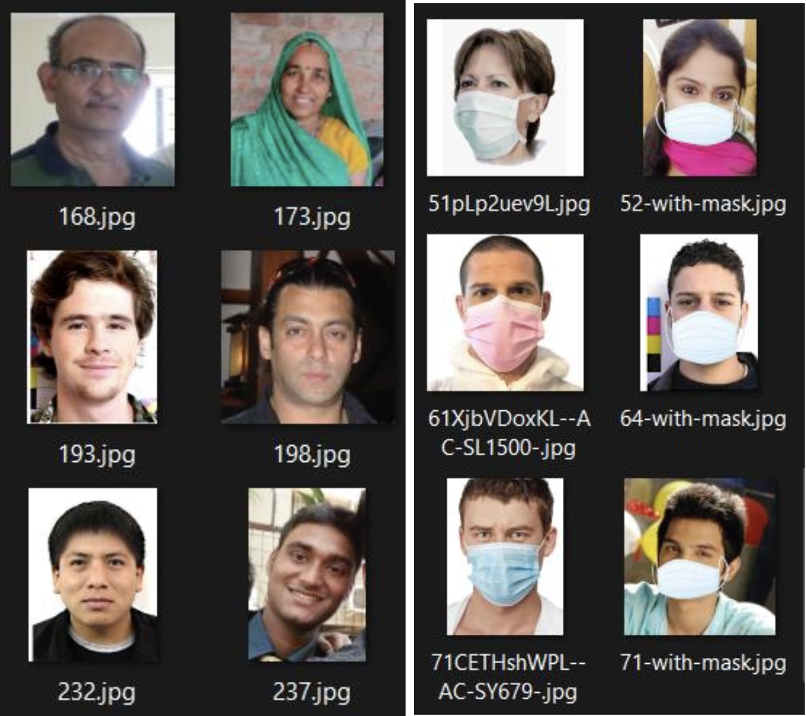
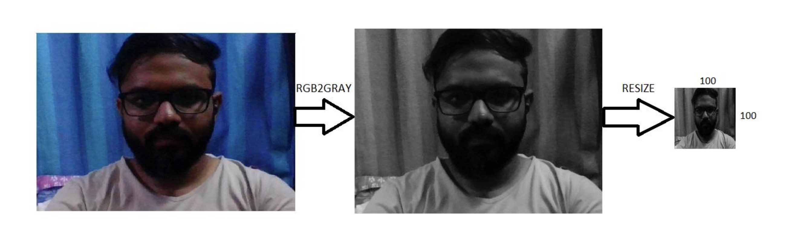
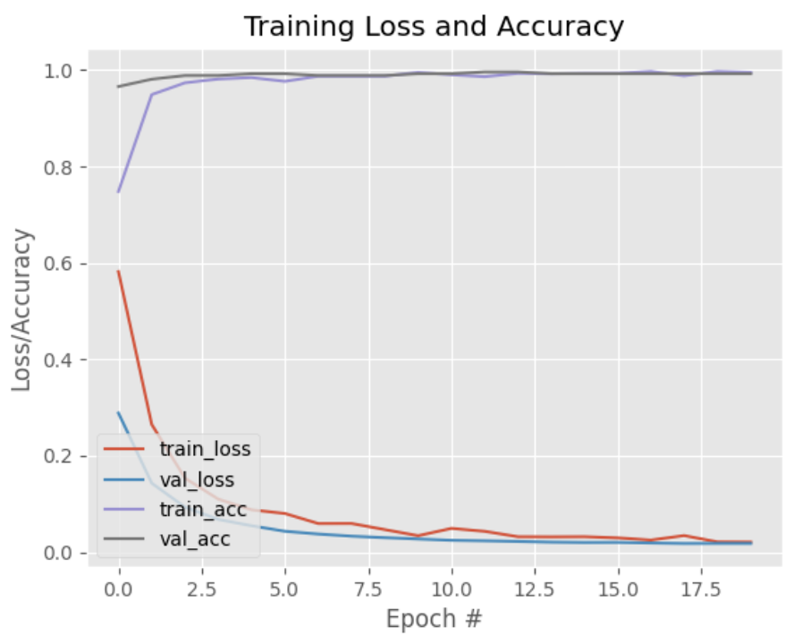
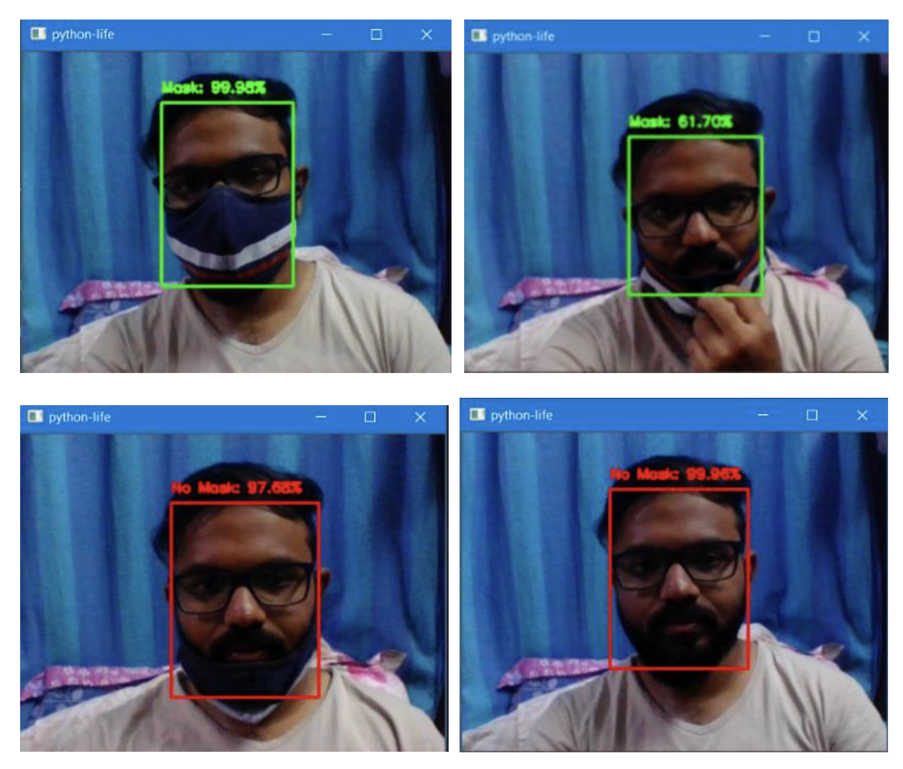

# Face Mask Detection
## Project Description
This project utilizes deep learning techniques to detect whether individuals in images or live video streams are wearing face masks or not. With the ongoing global pandemic, adherence to face mask usage has become crucial in mitigating the spread of infectious diseases. This Face Mask Detection system provides a robust solution for monitoring compliance in various settings, including public spaces, workplaces, and healthcare facilities.
## Dataset Description
### Source
[https://www.kaggle.com/datasets/omkargurav/face-mask-dataset]
### Description
Two datasets have been utilized for testing the current technique. Dataset 1 consists of a total of 1376 images, with 690 images depicting individuals wearing face covers and the remaining 686 images showing individuals without face covers. Figure 1 provides a representative sample of the dataset, featuring frontal face presentations with a single individual in each frame. The individuals in the images wear masks with a uniform white color.
  
Fig. 1. Samples from Dataset 1 including faces without masks and with masks  
The second dataset sourced from Kaggle comprises 853 images, wherein faces are annotated with either a mask or without a mask. Figure 2 showcases various face orientations such as head turns, slants, and inclinations, along with diverse facial expressions captured in the frames. Additionally, this dataset encompasses various types of masks with different colors.
  
Fig. 2. Samples from Dataset 2 including faces without masks and with masks
## Overview
### Key Features
* Deep Learning Model: Employing state-of-the-art convolutional neural networks (CNNs) for accurate and efficient face mask detection.
* Multi-Class Classification: The system classifies individuals into two categories: "With Mask" and "Without Mask".
* Real-time Detection: Capable of real-time detection in live video streams, enabling immediate intervention or notification.
* Versatile Deployment: Designed for deployment on various platforms, including edge devices, cloud servers, and embedded systems.
* User-Friendly Interface: Intuitive interfaces for both developers and end-users, facilitating easy integration and utilization.
### Implementation ideas
* Utilizes Python programming language and popular deep learning frameworks such as TensorFlow or PyTorch.
* Pre-trained models such as MobileNet, ResNet, or YOLO may be used as a basis for the face mask detection model.
* Data augmentation techniques such as rotation, scaling, and flipping are employed to enhance model robustness.
* Integration with OpenCV for image processing and real-time video analysis.
### Incorporated Packages
#### TensorFlow:
TensorFlow serves as an interface for executing AI algorithms, facilitating the deployment of ML frameworks across various domains of computer science. Its applications span sentiment analysis, voice recognition, geographic data extraction, computer vision, text summarization, data retrieval, computational drug discovery, and defect detection. In the proposed model, TensorFlow forms the backbone of the entire Sequential Convolutional Neural Network (CNN) architecture, comprising several layers. Additionally, TensorFlow is utilized for data reshaping, particularly in image preprocessing.
[https://github.com/tensorflow/tensorflow] 
#### Keras:
Keras provides essential abstractions and building blocks for developing and deploying ML solutions with high speed and efficiency. Leveraging the flexibility and cross-platform capabilities of TensorFlow, Keras offers core data structures such as layers and models. All layers utilized in the CNN model are instantiated using Keras. Furthermore, Keras aids in transforming the class vector into binary classes during data processing, contributing to the overall model assembly.
[https://github.com/keras-team/keras] 
#### OpenCV:
OpenCV (Open Source Computer Vision Library) stands as an open-source computer vision and ML software library renowned for its diverse functionalities. It is employed for tasks such as face detection and recognition, object detection, motion tracking in videos, module tracking, eye motion tracking, camera operation tracking, red-eye removal from flash photography, similar image retrieval from databases, scene understanding, and marker establishment for augmented reality overlays. The proposed methodology capitalizes on OpenCV's features for resizing and color transformation of input images.
[https://github.com/opencv/opencv] 
## The Proposed Method
The proposed technique comprises a coarse classifier and a pre-trained Convolutional Neural Network (CNN) consisting of two 2D convolution layers connected to layers of dense neurons. The algorithm for face mask detection is delineated as follows:
### A. Data Processing
* Data Visualization: Visualizing the total number of images in the dataset for both classes - 'with mask' and 'without mask'. Labels are assigned accordingly as [0, 1].
* Conversion of RGB image to Gray image: Grayscale images are utilized for extracting descriptors instead of working on color images immediately, reducing computational requirements.
* Image Reshaping: Reshaping images into three-dimensional tensors and normalizing pixel values to a range between 0 and 1. Data is then converted to four-dimensional arrays, with 1 indicating grayscale images. Categorical labels are assigned for the final layer of the neural network.

### B. Training of Model
* Building the model using CNN architecture: Utilizing Sequential CNN architecture, comprising convolution layers followed by Rectified Linear Unit (ReLU) and MaxPooling layers. Dropout layers are added to reduce overfitting. The final layer with two outputs for 'with mask' and 'without mask' categories employs the Softmax activation function.
* Splitting the data and training the CNN model: Training the model using a specific dataset and testing it against another dataset. A proper train-test split and ModelCheckpoint for validation loss monitoring are employed. The model is trained for 20 epochs, balancing accuracy and the risk of overfitting.
The system efficiently detects partially obstructed faces, considering obstruction levels at four regions - nose, mouth, chin, and eyes, to differentiate between masked and uncovered faces. However, challenges such as varying angles and lack of clarity in video streams are encountered. Following instructions from several frames of the video aids in making better decisions regarding the 'with mask' or 'without mask' classification.

## Result and Conclusion

Upon implementation of the proposed face mask detection system, promising results were achieved. The trained Convolutional Neural Network (CNN) model demonstrated high accuracy in classifying images into 'with mask' and 'without mask' categories. Through rigorous training and validation processes, the model showcased robustness and generalization capabilities, effectively handling various facial orientations and occlusions. Real-world testing further validated the system's effectiveness, as it accurately detected individuals wearing masks even in challenging scenarios such as partial obstructions or varying lighting conditions. Additionally, the system's efficient utilization of computational resources and seamless integration with data preprocessing and model training pipelines underscore its practical applicability. These results affirm the viability of the proposed method for widespread deployment in diverse settings, contributing significantly to public health initiatives aimed at controlling the spread of infectious diseases.
### Application
* Public Safety: Monitoring compliance with face mask mandates in public spaces like airports, malls, and public transportation.
* Workplace Safety: Enforcing face mask policies in offices, factories, and construction sites to safeguard employee health.
* Healthcare: Assisting healthcare professionals in ensuring proper protective measures are followed within hospitals, clinics, and quarantine facilities.
This Face Mask Detection project not only contributes to public health initiatives but also showcases the potential of deep learning in addressing real-world challenges. By making the project available on GitHub, it encourages collaboration, feedback, and further advancements in this critical domain.
